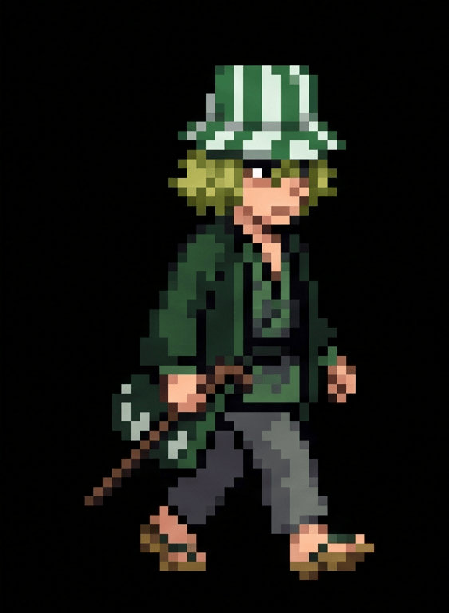

# 🎴 The Soul Society Research & Development Institute | AjaiKumarDY 🗡️

  

    

  <!-- Dynamic Typing Header -->
  

  
<em>"There is nothing in this world that is truly perfect. That's why ordinary people admire perfection and seek to obtain it." — Kisuke Urahara</em>

  <!-- Badges -->
  

    
    
    
  

---

## 🔬 Research & Development Arsenal (Tech Stack)

### 🗡️ Primary Zanpakuto Capabilities (Frontend Mastery)

  
  
  
  
  
  

### 🌀 Hado & Bakudo Tools (Development Environment)

  
  
  

---

## ⛩️ Classified Soul Society Archives (Featured Projects)

   _________________________________________________________
  /                                                         \
 |   [01] AnimeLog ── Cinematic Tracker & Anime Hub          |
 |        Status: ACTIVE | Reiatsu Level: Overwhelming      |
 |                                                          |
 |   [02] Navguard ── Web Protection & Navigation Matrix    |
 |        Status: ACTIVE | Security Seal: Unbroken          |
  \_________________________________________________________/

  
🔍 <strong>Click to Inspect Research Data (Project Details)</strong>

   

  - **🎬 AnimeLog**: Built with Next.js & Tailwind CSS for cinematic anime tracking.
  - **🧭 Navguard**: Modern web navigation and safety platform.

---

## ⚡ Spiritual Power Analysis (GitHub Combat Stats)

  <!-- Streak Stats Card -->
  

  <!-- Language Card -->
  

    

  <!-- Main GitHub Stats Card -->
  

---

## ⚔️ Espada Rank & Reiatsu Growth (Contribution Graph)

  

---

  "Nothin' wrong with taking the safe route, but if you only walk on safe paths, you'll never see what's past the horizon."

